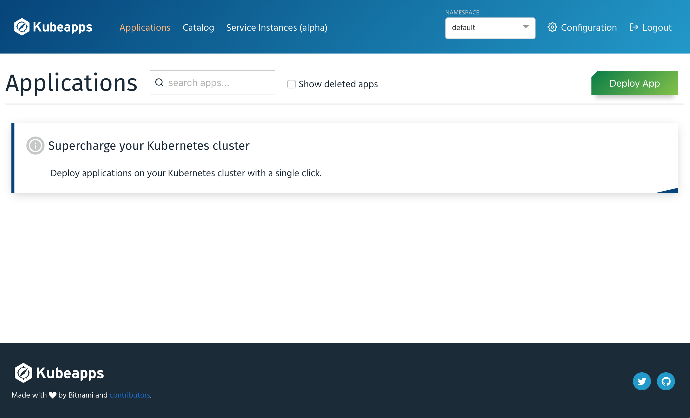

#  Kubeapps

[](https://circleci.com/gh/kubeapps/kubeapps/tree/master)

Kubeapps is a web-based UI for deploying and managing applications in Kubernetes clusters. Kubeapps allows you to:

- Browse and deploy [Helm](https://github.com/helm/helm) charts from chart repositories
- Inspect, upgrade and delete Helm-based applications installed in the cluster
- Add custom and private chart repositories (supports [ChartMuseum](https://github.com/helm/chartmuseum) and [JFrog Artifactory](https://www.jfrog.com/confluence/display/RTF/Helm+Chart+Repositories))
- Browse and provision external services from the [Service Catalog](https://github.com/kubernetes-incubator/service-catalog) and available Service Brokers
- Connect Helm-based applications to external services with Service Catalog Bindings
- Secure authentication and authorization based on Kubernetes [Role-Based Access Control](docs/user/access-control.md)

## Quickstart

Kubeapps assumes a working Kubernetes cluster (v1.8+), [`Helm`](https://helm.sh/) (2.9.1+) installed in your cluster and [`kubectl`](https://kubernetes.io/docs/tasks/tools/install-kubectl/) installed and configured to talk to your Kubernetes cluster. Kubeapps has been tested with Azure Kubernetes Service (AKS), Google Kubernetes Engine (GKE),`minikube` and Docker for Desktop Kubernetes. Kubeapps works on RBAC-enabled clusters and this configuration is encouraged for a more secure install.

> On GKE, you must either be an "Owner" or have the "Container Engine Admin" role in order to install Kubeapps.

> **IMPORTANT**: Kubeapps v1.0.0-alpha.4 and below used the `kubeapps` CLI to install Kubeapps, Tiller and other components. Please [see the migration guide](docs/user/migrating-to-v1.0.0-alpha.5.md) when upgrading from a previous version to v1.0.0-alpha.5 and above.

Use the Helm chart to install the latest version of Kubeapps:

```bash
helm repo add bitnami https://charts.bitnami.com/bitnami
helm install --name kubeapps --namespace kubeapps bitnami/kubeapps
```

> **IMPORTANT** This assumes an insecure Helm installation, which is not recommended in production. See [the documentation to learn how to secure Helm and Kubeapps in production](docs/user/securing-kubeapps.md).

The above commands will deploy Kubeapps into the `kubeapps` namespace in your cluster, it may take a few seconds to execute. For more information on installing and configuring Kubeapps, checkout the [chart README](chart/kubeapps/README.md).

Once it has been deployed and the Kubeapps pods are running, port-forward to access the Dashboard:

```bash
export POD_NAME=$(kubectl get pods -n kubeapps -l "app=kubeapps,release=kubeapps" -o name)
echo "Visit http://127.0.0.1:8080 in your browser to access the Kubeapps Dashboard"
kubectl port-forward -n kubeapps $POD_NAME 8080:8080
```


Access to the dashboard requires a Kubernetes API token to authenticate with the Kubernetes API server. Read the [Access Control](docs/user/access-control.md) documentation for more information on configuring users for Kubeapps.

The following commands create a ServiceAccount and ClusterRoleBinding named `kubeapps-operator` which will enable the dashboard to authenticate and manage resources on the Kubernetes cluster:

```bash
kubectl create serviceaccount kubeapps-operator
kubectl create clusterrolebinding kubeapps-operator --clusterrole=cluster-admin --serviceaccount=default:kubeapps-operator
```

Use the following command to reveal the authorization token that should be used to authenticate the Kubeapps dashboard with the Kubernetes API:

```bash
kubectl get secret $(kubectl get serviceaccount kubeapps-operator -o jsonpath='{.secrets[].name}') -o jsonpath='{.data.token}' | base64 --decode
```

**NOTE**: It's not recommended to create cluster-admin users for Kubeapps. Please refer to the [Access Control](docs/user/access-control.md) documentation to configure more fine-grained access.



To remove Kubeapps from your cluster, simply run:

```bash
helm delete --purge kubeapps
kubectl delete crd apprepositories.kubeapps.com
```

To delete the `kubeapps-operator` ServiceAccount and ClusterRoleBinding,

```bash
kubectl delete clusterrolebinding kubeapps-operator
kubectl delete serviceaccount kubeapps-operator
```

## Build from Source

Please refer to the [Kubeapps Build Guide](docs/developer/build.md) for instructions on setting up the build environment and building Kubeapps from source.

## Developer Documentation

Please refer to the [Kubeapps Developer Documentation](docs/developer/README.md) for instructions on setting up the developer environment for developing on Kubeapps and its components.

## Next Steps

[Use Kubeapps](docs/user/dashboard.md) to easily manage your applications running in your cluster, or [look under the hood to see what's included in Kubeapps](docs/architecture/overview.md).


For a more detailed and step-by-step introduction to Kubeapps, read our [introductory walkthrough](docs/user/getting-started.md).

## Useful Resources

* [Walkthrough for first-time users](docs/user/getting-started.md)
* [Detailed installation instructions](chart/kubeapps/README.md)
* [Kubeapps Dashboard documentation](docs/user/dashboard.md)
* [Kubeapps components](docs/architecture/overview.md)
